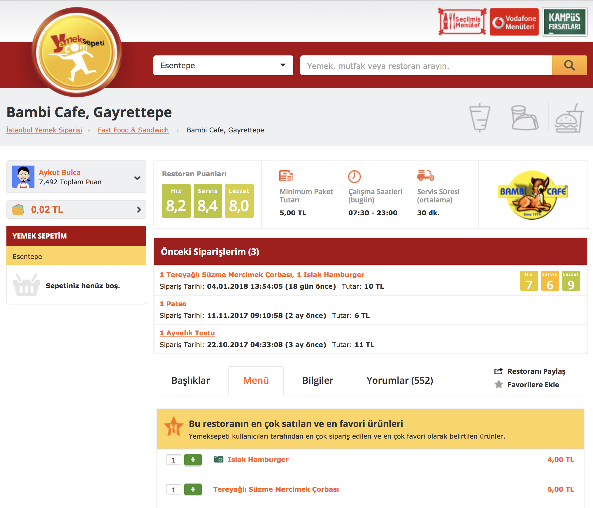

# Yemeksepeti Restaurant Page Extender
Display your previous orders from a specific restaurant, in the restaurant's Yemeksepeti page.

## Installation

After downloading/cloning the repository to your local computer, run following commands in the parent folder:

```
npm i 
gulp
```

These commands will create the related JS files, which you can easily import to your Chrome or Mozilla browser. (Or you can use precompiled files under build folder.)

## Screenshots


